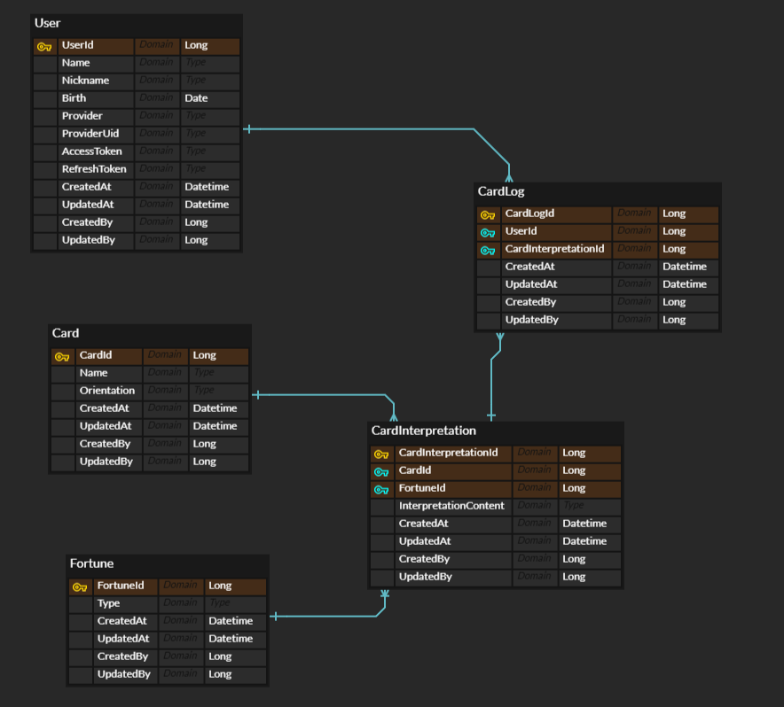

## **앱 이름**
오늘의 운세바라 (FortuneBara)

---

## **앱 설명**
“오늘의 운세바라” 서비스는 귀엽고 친화력 좋은 카피바라 동자가 매일매일 당신의 운세를 점쳐주는 온라인 타로 운세 플랫폼입니다.
단순한 재미를 넘어, 정교한 타로 분석을 기반으로 보다 신뢰할 수 있는 운세 해석과 심층적인 상담 경험을 제공할 예정입니다.

---

## **주요 특징**
카피바라 동자의 통찰력으로 당신의 하루 운세와 행운을 포착해드립니다. 
간단히 **이름, 생년월일**만 입력하면, 귀엽고도 정확한 운세 메시지를 받아볼 수 있습니다.

---

## **버전 정보**
- **JDK:** 17
- **Spring Boot:** 3.4.1
- **Spring Boot 관련 라이브러리 버전:**
    - Spring Security 6.4.2
    - Spring Web 6.2.1
    - Spring Data JPA 3.4.1
- **Database 관련 라이브러리 버전:**
  - Jakarta Persistence 3.1.0
  - MySQL Connector 9.1.0
  - H2 Database: 2.3.232
- **Jackson 관련 라이브러리 버전:**
  - Jackson Core: 2.18.2
  - Jackson Datatype Hibernate5: 2.18.2
- **테스트 관련 라이브러리 버전:**
  - JUnit Jupiter: 5.11.4
  - Mockito Core: 5.14.2

---

## **사용된 Third-Party 및 기술 스택**
- **Spring Data JPA**
- **Spring Security**
- **Google OAuth2**
- **MySQL**
- **Redis**
- **Docker**
- **AWS EC2**
- **GitHub Actions**
---

## **API 정의서와 상태 코드**
### **📌 User API 문서**

#### **[POST] 회원가입**
- **Endpoint:** `/user/sign-up`
- **Request Body:**
  ```json
  {
    "userId": 123,
    "name": "홍길동",
    "email": "test@example.com",
    "nickname": "testuser",
    "birth": "1995-07-30",
    "provider": "google",
    "providerUid": "google-12345",
    "accessToken": "access-token-example",
    "refreshToken": "refresh-token-example"
  }
  ```
- **Response:**
  ```json
  {
    "userId": 123,
    "name": "홍길동",
    "email": "test@example.com",
    "nickname": "testuser",
    "birth": "1995-07-30",
    "provider": "google",
    "providerUid": "google-12345",
    "accessToken": "access-token-example",
    "refreshToken": "refresh-token-example",
    "isRegistered": true,
    "createdAt": "2025-01-28 12:00:00",
    "updatedAt": "2025-01-28 12:00:00",
    "createdBy": 101,
    "updatedBy": 101
  }
  ```
- **Status Codes:**
  - `201 Created` : 회원가입 성공
  - `400 Bad Request` : 요청 데이터 오류

---

#### ** [GET] 특정 사용자 정보 조회**
- **Endpoint:** `/user/{userId}`
- **Path Parameter:**
  - `userId` (Long) : 조회할 사용자 ID
- **Response:**
  ```json
  {
    "userId": 123,
    "name": "홍길동",
    "email": "test@example.com",
    "nickname": "testuser",
    "birth": "1995-07-30",
    "provider": "google",
    "providerUid": "google-12345",
    "accessToken": "access-token-example",
    "refreshToken": "refresh-token-example",
    "isRegistered": true,
    "createdAt": "2025-01-28 12:00:00",
    "updatedAt": "2025-01-28 12:00:00",
    "createdBy": 101,
    "updatedBy": 101
  }
  ```
- **Status Codes:**
  - `200 OK` : 조회 성공
  - `404 Not Found` : 해당 사용자가 없음

---

#### ** [PUT] 사용자 정보 수정**
- **Endpoint:** `/user/{userId}`
- **Path Parameter:**
  - `userId` (Long) : 수정할 사용자 ID
- **Request Body:**
  ```json
  {
    "name": "김철수",
    "nickname": "newnickname",
    "birth": "2000-01-01"
  }
  ```
- **Response:**
  ```json
  {
    "userId": 123,
    "name": "김철수",
    "email": "test@example.com",
    "nickname": "newnickname",
    "birth": "2000-01-01",
    "provider": "google",
    "providerUid": "google-12345",
    "accessToken": "access-token-example",
    "refreshToken": "refresh-token-example",
    "isRegistered": true,
    "createdAt": "2025-01-28 12:00:00",
    "updatedAt": "2025-01-28 13:00:00",
    "createdBy": 101,
    "updatedBy": 103
  }
  ```
- **Status Codes:**
  - `200 OK` : 수정 성공
  - `400 Bad Request` : 요청 데이터 오류
  - `404 Not Found` : 해당 사용자가 없음

---

#### ** [DELETE] 사용자 삭제**
- **Endpoint:** `/user/{userId}`
- **Path Parameter:**
  - `userId` (Long) : 삭제할 사용자 ID
- **Response:**
  - **Status Code:** `204 No Content` (삭제 성공)
  - **Status Code:** `404 Not Found` (해당 사용자가 없음)

---

#### ** [GET] 모든 사용자 조회**
- **Endpoint:** `/user`
- **Response:**
  ```json
  [
    {
      "userId": 123,
      "name": "홍길동",
      "email": "test@example.com",
      "nickname": "testuser",
      "birth": "1995-07-30",
      "provider": "google",
      "providerUid": "google-12345",
      "accessToken": "access-token-example",
      "refreshToken": "refresh-token-example",
      "isRegistered": true,
      "createdAt": "2025-01-28 12:00:00",
      "updatedAt": "2025-01-28 12:00:00",
      "createdBy": 101,
      "updatedBy": 101
    },
    {
      "userId": 456,
      "name": "이영희",
      "email": "another@example.com",
      "nickname": "anotheruser",
      "birth": "2000-12-15",
      "provider": "kakao",
      "providerUid": "kakao-67890",
      "accessToken": "access-token-example-2",
      "refreshToken": "refresh-token-example-2",
      "isRegistered": false,
      "createdAt": "2025-01-28 12:30:00",
      "updatedAt": "2025-01-28 12:45:00",
      "createdBy": 102,
      "updatedBy": 103
    }
  ]
  ```
- **Status Codes:**
  - `200 OK` : 조회 성공

---

### **📌 Card API 문서**

#### **[POST] 카드 생성**
- **Endpoint:** `/card`
- **Request Body:**
  ```json
  {
    "name": "The Fool",
    "orientation": "UPRIGHT"
  }
  ```
- **Response:**
  ```json
  {
    "cardId": 1,
    "name": "The Fool",
    "orientation": "UPRIGHT",
    "createdAt": "2025-01-28T12:00:00",
    "updatedAt": "2025-01-28T12:00:00",
    "createdBy": 101,
    "updatedBy": 101
  }
  ```
- **Status Codes:**
  - `201 Created` : 카드 생성 성공
  - `400 Bad Request` : 요청 데이터 오류

---

#### **[GET] 특정 카드 조회**
- **Endpoint:** `/card/{cardId}`
- **Path Parameter:**
  - `cardId` (Long) : 조회할 카드 ID
- **Response:**
  ```json
  {
    "cardId": 1,
    "name": "The Magician",
    "orientation": "REVERSED",
    "createdAt": "2025-01-28T12:00:00",
    "updatedAt": "2025-01-28T12:30:00",
    "createdBy": 101,
    "updatedBy": 102
  }
  ```
- **Status Codes:**
  - `200 OK` : 조회 성공
  - `404 Not Found` : 해당 카드가 없음

---

#### **[PUT] 카드 정보 수정**
- **Endpoint:** `/card/{cardId}`
- **Path Parameter:**
  - `cardId` (Long) : 수정할 카드 ID
- **Request Body:**
  ```json
  {
    "name": "The High Priestess",
    "orientation": "UPRIGHT"
  }
  ```
- **Response:**
  ```json
  {
    "cardId": 1,
    "name": "The High Priestess",
    "orientation": "UPRIGHT",
    "createdAt": "2025-01-28T12:00:00",
    "updatedAt": "2025-01-28T13:00:00",
    "createdBy": 101,
    "updatedBy": 103
  }
  ```
- **Status Codes:**
  - `200 OK` : 수정 성공
  - `400 Bad Request` : 요청 데이터 오류
  - `404 Not Found` : 해당 카드가 없음

---

#### **[DELETE] 카드 삭제**
- **Endpoint:** `/card/{cardId}`
- **Path Parameter:**
  - `cardId` (Long) : 삭제할 카드 ID
- **Response:**
  - **Status Code:** `204 No Content` (삭제 성공)
  - **Status Code:** `404 Not Found` (해당 카드가 없음)

---

#### **[GET] 모든 카드 조회**
- **Endpoint:** `/card`
- **Response:**
  ```json
  [
    {
      "cardId": 1,
      "name": "The Fool",
      "orientation": "UPRIGHT",
      "createdAt": "2025-01-28T12:00:00",
      "updatedAt": "2025-01-28T12:00:00",
      "createdBy": 101,
      "updatedBy": 101
    },
    {
      "cardId": 2,
      "name": "The Magician",
      "orientation": "REVERSED",
      "createdAt": "2025-01-28T12:15:00",
      "updatedAt": "2025-01-28T12:45:00",
      "createdBy": 102,
      "updatedBy": 103
    }
  ]
  ```
- **Status Codes:**
  - `200 OK` : 조회 성공

---
## **ERD (Entity Relationship Diagram)**


---